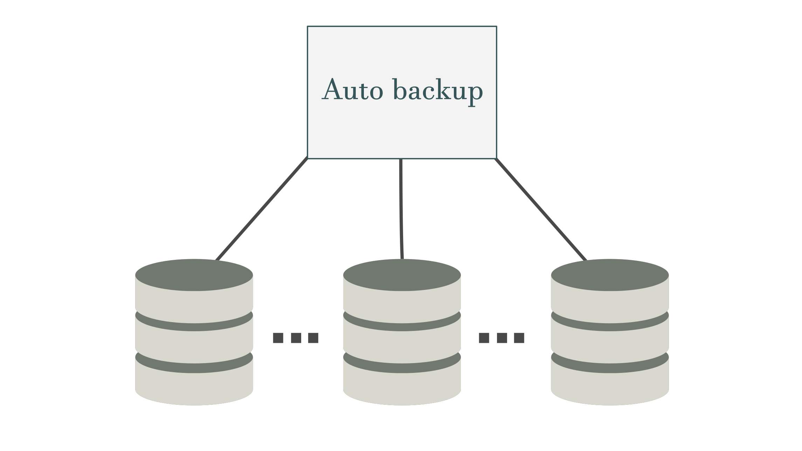
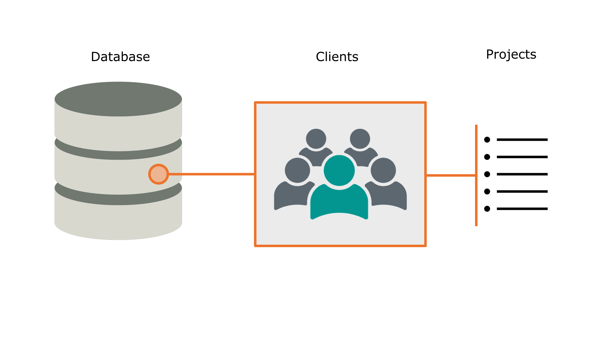

# Automatic database backup system  
Auto backup is an easy to use interactive CLI made to manage a distributed projects database. The initial purpose of this project is to provide a backup system for **BcnVisuals**.  
Each database is organized in different sub-databases/categories that are shared simmetrically between each distributed database. This categories contain within different clients and inside each client different projects are included. Each database works independently and each might contain different clients and different categories of the same project. The CLI provides the user a way to interact with the database from which it can view all the databases and compare their contents; as a backup utility, it also enables the functionality of copying categories of a project between databases. 

## Interactive mode 
The main mode that is used when using the application is the **interactive mode**, in this mode, the user can execute commands sequentially and get a response inmediately. In the interactive mode it is very simple and easy to interact with each of the databases clients and projects independently. Each time you launch the CLI a set of databases is loaded, this databases are user specified, this way it is very easy to configure different instances of auto_backup that manage a different set of databses or categories. 

## Scripting mode 
As an additional functionality, auto_backup is built up as command parser, thus it is able to parse input files and create automated 
tasks that must be executed repeatedly. For instance, the the configuration file `.config` is in fact a list of commands that are executed when launching the interactive mode.  

## Functionalities 
The program contains a variety of functions that can be executed in interactive or scripting mode. 
  * **help** outputs the list of commands available in the program 
  * **fetch** this command lists the requestes projects and displays their locations and the size they use. 
  * **copy** to perform backups between databases, it copies files. 
  * **list** displays a list of the existing clients or projects 
  * **load** performs a disk check that reads the databases and load their current status 
  * **add** this command enables the user to add databases and categories to track 
  * **explore*** as an additional help, explore opens a file explorer (e.g. nautilus) in the requested project location 
  * **exit** exists interactive mode 

## Requirements 
The project is self contained and does not need any external libraries, it is build only with python. 
